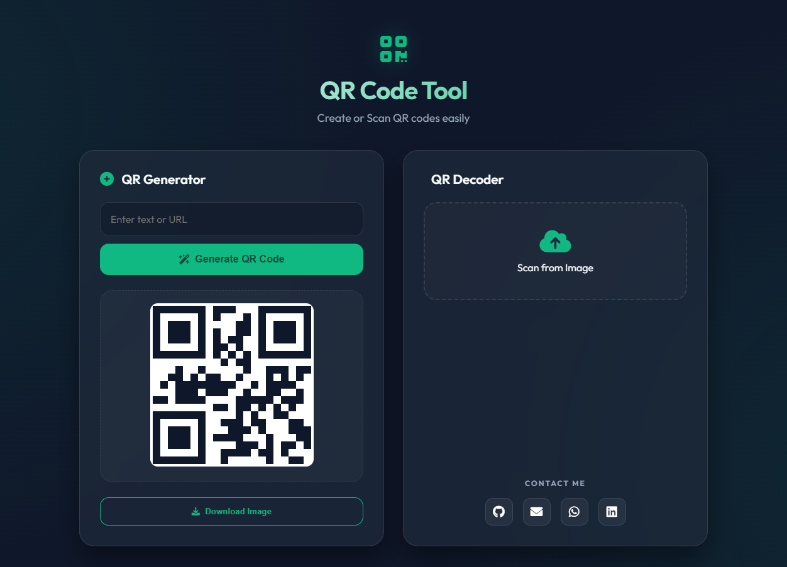

# QR Code Tool

A modern web application designed to generate and decode QR codes efficiently. This project features a premium design with Glassmorphism aesthetics and a fully responsive interface.

### [🔗 Live Demo](https://wdisthis.github.io/qrcode/)




## Core Features

| Feature | Description |
| :--- | :--- |
| QR Generator | Allows users to create QR codes from any text or URL instantly. |
| QR Decoder | Allows users to upload QR code images to extract and view the encoded data. |
| Download Image | Functionality to save the generated QR code as a PNG image file. |
| Copy to Clipboard | Quickly copy the decoded text results with a single click. |
| Visit in Browser | Automatically open decoded links in a new browser tab. |
| Toast Notification | A visual feedback system to provide updates on every user action. |

## Technology Stack

| Technology | Purpose |
| :--- | :--- |
| HTML5 | Used to build the semantic structure of the application. |
| CSS3 | Used for visual styling, animations, and responsive layout. |
| JavaScript (Vanilla) | Used for application logic and handling user interactions. |
| QRious | Third-party library used to generate QR codes on a canvas. |
| jsQR | Third-party library used to scan and decode data from images. |
| Font Awesome | Used to provide visual icons for the user interface. |

## Folder Structure

The following is the directory structure of this project:

```text
qrcode/
├── index.html         # Main file containing the HTML structure
├── script/
│   └── app.js         # JavaScript application logic file
├── style/
│   └── style.css      # CSS visual design and styling file
└── png/
    └── qrcode.png     # Web preview image file
```

## How to Use

1. Open the index.html file in your preferred web browser.
2. To generate a QR code, enter text or a URL in the input field under the QR Generator section, then click Generate.
3. To decode a QR code, upload an image file containing a QR code through the QR Decoder section.
4. Use the download button to save the image, or the copy button to copy the scanned text results.
